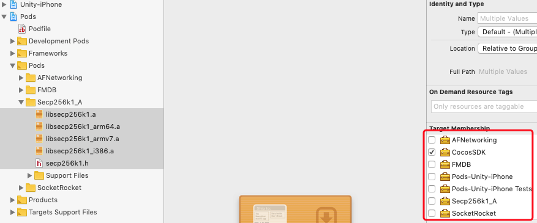

[English](https://github.com/Cocos-BCX/iOSSDK "English")

# CocosSDK 集成使用文档

[](https://travis-ci.org/SYLing/CocosSDK)
[](https://cocoapods.org/pods/CocosSDK)
[](https://cocoapods.org/pods/CocosSDK)
[](https://cocoapods.org/pods/CocosSDK)

## Example

- 要运行示例项目，请克隆repo，然后首先从示例目录运行 'pod install' (如果没有安装 CocoaPods , 需要先安装)。
- 在 Xcode 中, 修改 Secp256k1_A 的配置, 如图:

    

## 依赖库

- 依赖库
	- AFNetworking
	- FMDB
	- Secp256k1_A
	- SocketRocket

## 安装

1. 使用 CocoaPods 集成安装(待支持)

	```ruby
	pod 'CocosSDK'
	```

2. 手动集成
	- 添加 CocosSDK 目录下 Class 文件夹所有文件。
	- 添加依赖库到项目中。

## 基础功能

#### 初始化

1. 说明和用途
	- 初始化 SDK 基础，连接节点、配置 ChainId 和链标识

2. 接口函数

	```ruby
    /**
	 Initialize SDK
	 @param url RPC     Node
	 @param faucetUrl   URL Address
	 @param timeOut     Timeout
	 @param coreAsset   Chain identifier
	 @param chainId     Chain ID
	 @param connectedStatus Status of connection
	 */
	- (void)Cocos_ConnectWithNodeUrl:(NSString *)url
    	    Fauceturl:(NSString *)faucetUrl
        	   TimeOut:(NSTimeInterval)timeOut
	        CoreAsset:(NSString *)coreAsset
    	       ChainId:(NSString *)chainId
	    ConnectedStatus:(void (^)(WebsocketConnectStatus 	connectStatus))connectedStatus;
    ```

3. 示例代码

	```ruby
	- (BOOL)application:(UIApplication *)application didFinishLaunchingWithOptions:(NSDictionary *)launchOptions
{
	// 测试节点
    [[CocosSDK shareInstance] Cocos_ConnectWithNodeUrl:@"ws://39.106.126.54:8050" Fauceturl:@"http://47.93.62.96:3000" TimeOut:2 CoreAsset:@"COCOS" ChainId:@"53b98adf376459cc29e5672075ed0c0b1672ea7dce42b0b1fe5e021c02bda640" ConnectedStatus:^(WebsocketConnectStatus connectStatus) {
    }];
    return YES;
}
	```

#### 设置日志输出

1. 说明和用途
	- 设置是否在console输出sdk的log信息。

2. 接口函数

    ```ruby
	/**
	 *  Open debug log
	 *
	 *  @param isOpen YES means open，No means close
	 */
	- (void)Cocos_OpenLog:(BOOL)isOpen;
    ```


## 创建账户

1. 说明和用途

#### 钱包模式
- 钱包模式创建账户，钱包模式创建的账户不能用账户名密码登录。

#### 账户模式
- 账户模式创建账户，钱包模式创建的账户可以用账户名密码登录。

2. 接口函数

	```ruby
	/**
	 Create account

	 @param walletMode  Mode of wallet
	 @param accountName Account
	 @param password    Password
	 @param autoLogin   Auto log in
	 */
	- (void)Cocos_CreateAccountWalletMode:(CocosWalletMode)walletMode
         AccountName:(NSString *)accountName
            Password:(NSString *)password
           AutoLogin:(BOOL)autoLogin
             Success:(SuccessBlock)successBlock
               Error:(Error)errorBlock;

	```

#### 删除/退出钱包

1. 使用说明
	- 清除 SDK 保存的登录和导入记录

2. 接口函数

    ```ruby

    /**
     Delete wallet
     @param accountName Account
     */
    - (void)Cocos_DeleteWalletAccountName:(NSString *)accountName
              Success:(SuccessBlock)successBlock
                Error:(Error)errorBlock;
	```

#### 登录钱包

1. 使用说明
	- 账户模式下，使用账户名和密码登录钱包

2. 接口函数

    ```ruby
    /**
     Log in by account

     @param accountName Account
     @param password    Password
     */
    - (void)Cocos_LoginAccountWithName:(NSString *)accountName
              Password:(NSString *)password
                Success:(SuccessBlock)successBlock
                  Error:(Error)errorBlock;
    ```

#### 转账

1. 使用说明
	- 转账

2. 接口函数
    ```ruby
    /**
     Transfer

     @param fromName        Sender's account
     @param toName          Receiver's account
     @param password        Password
     @param transferAsset   Asset's name(eg. COCOS)
     @param assetAmount     assetAmount Transfer amount
     @param feePayingAsset  Charge's currency(require)
     @param memo            Memo String
     */
    - (void)Cocos_TransferFromAccount:(NSString *)fromName
                  ToAccount:(NSString *)toName
                   Password:(NSString *)password
              TransferAsset:(NSString *)transferAsset
                AssetAmount:(NSString *)assetAmount
             FeePayingAsset:(NSString *)feePayingAsset
                       Memo:(NSString *)memo
                  Success:(SuccessBlock)successBlock
                    Error:(Error)errorBlock;
    ```

##	状态码
## 状态码说明

| code | message | 说明 |
| --- | --- | --- |
| 300 | Chain sync error, please check your system clock | 链同步错误，请检查您的系统时钟 |
| 301 | RPC connection failed. Please check your network | 连接RPC失败，请检查你的网络 |
| 1 | 无 | 操作成功 |
| 0 | failed | 操作失败，返回错误状态描述不固定，可直接提示res.message或统一提示为操作失败 |
| 101 | Parameter is missing | 参数缺失 |
| 1011 | Parameter error | 参数错误 | 
| 102 | The network is busy, please check your network connection | 网络繁忙，请检查你的网络连接 |
| 103 | Please enter the correct account name(/^[a-z]([a-z0-9\.-]){4,63}/$) | 请输入正确的账户名(正则/^[a-z]([a-z0-9\.-]){4,63}/$) |
| 104 | XX not found | XX 不存在 |
| 105 | wrong password | 密码错误 |
| 106 | The account is already unlocked | 账户已经处于解锁状态 |
| 107 | Please import the private key | 请先导入私钥 |
| 108 | User name or password error (please confirm that your account is registered in account mode, and the account registered in wallet mode cannot be logged in using account mode) | 用户名或密码错误(请确认你的账户是通过账户模式注册的，钱包模式注册的账户不能使用账户模式登录) |
| 109 | Please enter the correct private key | 请输入正确的私钥 |
| 110 | The private key has no account information | 该私钥没有对应的账户信息 |
| 111 | Please login first | 请先登录 |
| 112 | Must have owner permission to change the password, please confirm that you imported the ownerPrivateKey | 必须拥有owner权限才可以进行密码修改,请确认你导入的是ownerPrivateKey |
| 113 | Please enter the correct original/temporary password | 请输入正确的原始密码/临时密码 |
| 114 | Account is locked or not logged in. | 帐户被锁定或未登录 | 
| 115 | There is no asset XX on block chain | 区块链上不存在资产 XX | 
| 116 | Account receivable does not exist | 收款方账户不存在 |
| 117 | The current asset precision is configured as X ,and the decimal cannot exceed X | 当前资产精度配置为 X ，小数点不能超过 X |
| 118 | Encrypt memo failed | 备注加密失败 |
| 119 | Expiry of the transaction | 交易过期 |
| 120 | Error fetching account record | 获取帐户记录错误 |
| 121 | block and transaction information cannot be found | 查询不到相关区块及交易信息 |
| 122 | Parameter blockOrTXID is incorrect | 参数blockOrTXID不正确 |
| 123 | Parameter account can not be empty | 参数account不能为空 |
| 124 | Receivables account name can not be empty | 收款方账户名不能为空 | 
| 125 | Users do not own XX assets | 用户未拥有 XX 资产 |
| 127 | No reward available | 没有可领取的奖励 |
| 129 | Parameter 'memo' can not be empty | memo不能为空 |
| 130 | Please enter the correct contract name(/^[a-z]([a-z0-9\.-]){4,63}$/) | 请输入正确的合约名称(正则/^[a-z]([a-z0-9\.-]){4,63}$/) | 
| 131 | Parameter 'worldView' can not be empty | 世界观名称不能为空 |
| 133 | Parameter 'toAccount' can not be empty | toAccount不能为空 |
| 135 | Please check parameter data type | 请检查参数数据类型 | 
| 136 | Parameter 'orderId' can not be empty | orderId不能为空 |
| 137 | Parameter 'NHAssetHashOrIds' can not be empty | NHAssetHashOrIds不能为空 |
| 138 | Parameter 'url' can not be empty | 接入点地址不能为空 |
| 139 | Node address must start with ws:// or wss:// | 节点地址必须以 ws:// 或 wss:// 开头 |
| 140 | API server node address already exists | API服务器节点地址已经存在 | 
| 141 | Please check the data in parameter NHAssets | 请检查参数NHAssets中的数据 |
| 142 | Please check the data type of parameter NHAssets | 请检查参数NHAssets的数据类型 |
| 144 | Your current batch creation / deletion / transfer number is X , and batch operations can not exceed X | 您当前批量 创建/删除/转移 NH资产数量为 X ，批量操作数量不能超过 X |
| 145 | XX contract not found | XX 合约不存在 | 
| 146 | The account does not contain information about the contract | 账户没有该合约相关的信息 | 
| 147 | NHAsset do not exist | 非同质资产不存在 | 
| 148 | Request timeout, please try to unlock the account or login the account | 请求超时，请尝试解锁账户或登录账户 | 
| 149 | This wallet has already been imported | 此私钥已导入过钱包 |
| 150 | Key import error | 导入私钥失败 |
| 151 | File saving is not supported | 您的浏览器不支持文件保存 | 
| 152 | Invalid backup to download conversion | 无效的备份下载转换 |
| 153 | Please unlock your wallet first | 请先解锁钱包 |
| 154 | Please restore your wallet first | 请先恢复你的钱包 |
| 155 | Your browser may not support wallet file recovery | 浏览器不支持钱包文件恢复 | 
| 156 | The wallet has been imported. Do not repeat import | 该钱包已经导入，请勿重复导入 |
| 157 | Can't delete wallet, does not exist in index | 请求超时，请尝试解锁账户或登录账户 |
| 158 | Imported Wallet core assets can not be XX , and it should be XX | 导入的钱包核心资产不能为 XX ，应为 XX | 
| 159 | Account exists | 账户已存在 | 
| 160 | You are not the creator of the Asset XX . | 你不是该资产的创建者 | 
| 161 | Orders do not exist | 订单不存在 | 
| 162 | The asset already exists | 资产已存在 |
| 163 | The wallet already exists. Please try importing the private key | 钱包已经存在，请尝试导入私钥 | 
| 164 | worldViews do not exist | 世界观不存在 | 
| 165 | There is no wallet account information on the chain | 链上没有该钱包账户信息 | 
| 166 | The Wallet Chain ID does not match the current chain configuration information. The chain ID of the wallet is: XX | 该钱包链id与当前链配置信息不匹配，该钱包的链id为： XXX |
| 167 | The current contract version ID was not found | 当前合约版本id没有找到 X |
| 168 | This subscription does not exist | 当前没有订阅此项 | 
| 169 | Method does not exist | API方法不存在 |


## 合作项目

- CocosBCXWallet

## License

CocosSDK is available under the MIT license. See the LICENSE file for more info.
